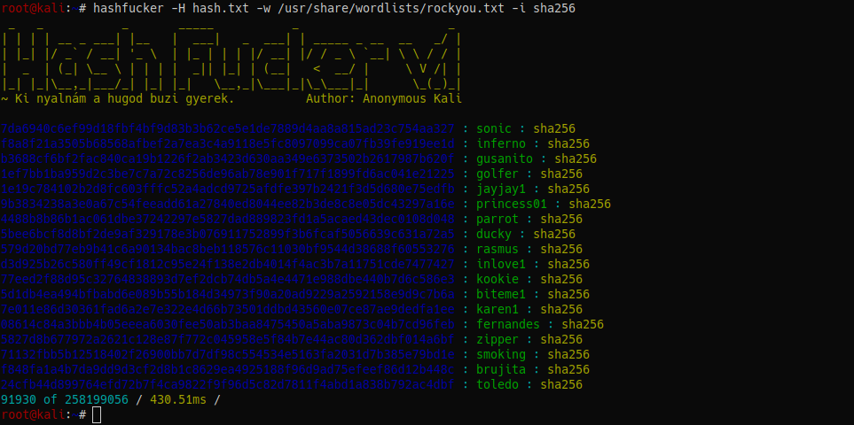

## hashfucker
hashfucker is a hash cracking tool in php

</img>

### Install
You will need to install php first
```
git clone https://github.com/kali69bazdmeg/hashfucker.git
cp hashfucker/hashfucker /usr/local/bin/hashfucker
chmod +x /usr/local/bin/hashfucker
```
### Usage
```
 _   _           _       _____           _                     _
| | | | __ _ ___| |__   |  ___|   _  ___| | _____ _ __  __   _/ |
| |_| |/ _` / __| '_ \  | |_ | | | |/ __| |/ / _ \ `__| \ \ / / |
|  _  | (_| \__ \ | | | |  _|| |_| | (__|   <  __/ |     \ V /| |
|_| |_|\__,_|___/_| |_| |_|   \__,_|\___|_|\_\___|_|      \_(_)_|
~ Amíg itt vagy, addig basszák a nődet.    Author: Anonymous Kali

-H, --hashlist       Hash-eket vagy hash-t tartalmazó fájl.
-h, --hash           Csak simán a hash-t baszasd oda geci.
-i, --hashtype       auto, crypt, vagy a hash Típusa.
-r, --report         Megbaszott hash-eket bele gecizi egy fájlba.
-n                   Nem sikeres törés esetén "hash not cracked" üzenet.

 Amiket meg tud baszni a cucc:
 md2; md4; md5; sha1; sha224; sha256; sha384; sha512/224; sha512/256; sha512; sha3-224
 sha3-256; sha3-384; sha3-512; ripemd128; ripemd160; ripemd256; ripemd320; whirlpool
 tiger128,3; tiger160,3; tiger192,3; tiger128,4; tiger160,4; tiger192,4; snefru
 snefru256; gost; gost-crypto; adler32; crc32; crc32b; crc32c; fnv132; fnv1a32; fnv164
 fnv1a64; joaat; haval128,3; haval160,3; haval192,3; haval224,3; haval256,3; haval128,4
 haval160,4; haval192,4; haval224,4; haval256,4; haval128,5; haval160,5; haval192,5
 haval224,5; haval256,5; md5crypt; bcrypt; sha1crypt; sha256crypt; sha512crypt;

Így csapasd:
 - hashfucker --hashlist hash.txt --wordlist john.lst --hashtype auto --report pina.txt
 - hashfucker -h '$1$dJ6uyylQ$ha.xgdgpirf5nE/TbxnNg1' -w rockyou.txt -i crypt -n
```

## License
Shield: [![CC BY-NC-SA 4.0][cc-by-nc-sa-shield]][cc-by-nc-sa]

This work is licensed under a
[Creative Commons Attribution-NonCommercial-ShareAlike 4.0 International License][cc-by-nc-sa].

[![CC BY-NC-SA 4.0][cc-by-nc-sa-image]][cc-by-nc-sa]

[cc-by-nc-sa]: http://creativecommons.org/licenses/by-nc-sa/4.0/
[cc-by-nc-sa-image]: https://licensebuttons.net/l/by-nc-sa/4.0/88x31.png
[cc-by-nc-sa-shield]: https://img.shields.io/badge/License-CC%20BY--NC--SA%204.0-lightgrey.svg
